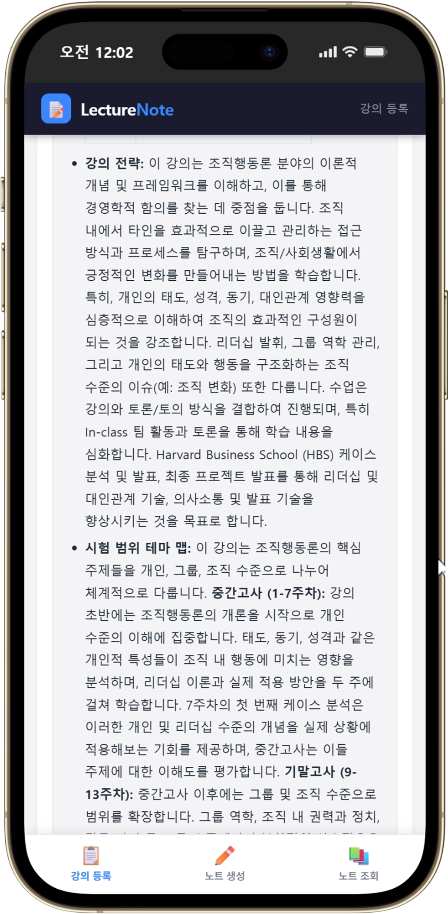
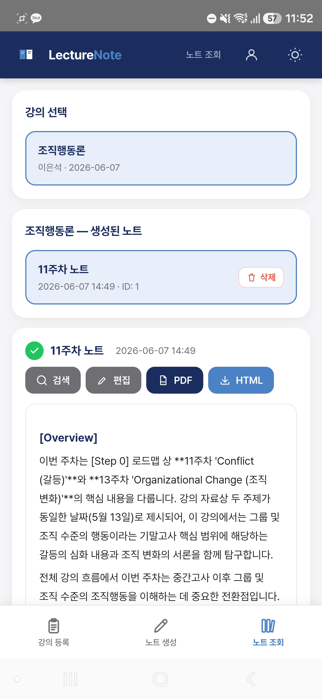

# LectureNote

> 분산된 강의 입력(음성·문서·필기)에서  
> **맥락 손실 없이** 구조화된 학습 노트를 생성하는  
> 맥락 인지형 LLM 파이프라인

| 항목 | 내용 |
|------|------|
| 기간 | 2026.03.06 – 2026.06.07 |
| 유형 | 개인 (학교 과제) |
| 담당 범위 | End-to-End (아키텍처 설계·전체 구현) |
| 핵심 역량 | LLM 파이프라인 · Context Orchestration · FastAPI/SSE |

**Live Demo** · [lecture-note-2cb6.onrender.com](https://lecture-note-2cb6.onrender.com) &nbsp;|&nbsp; **Android** · Google Play 비공개 테스트 직전 단계

---

## 문제 정의

지식 집약적 업무(강의, 회의, 감사, 컨설팅 인터뷰)에서 정보는 **항상 이기종 형태로 동시에 생성된다**. 음성, 문서, 필기가 각기 다른 채널로 흘러들어온다.

핵심 실패는 처리 자체가 아니라 **맥락의 소실**이다. 각 소스를 개별 요약하면 커리큘럼 구조, 도메인 용어 체계, 평가 방향 같은 상위 컨텍스트가 출력물에 반영되지 않는다. 결과물은 내용의 집합이지, 구조화된 지식이 아니다.

LLM 자체는 요약 능력이 뛰어나지만, 입력 컨텍스트가 구조화되어 있지 않으면 출력 품질은 source ordering과 prompt phrasing에 크게 의존한다. **문제의 핵심은 모델 성능이 아니라 context orchestration에 있다.**

---

## 왜 이 접근을 택했는가

문제의 핵심이 모델 성능이 아니라 context orchestration이라면, 해법도 prompt engineering이 아니라 **context architecture**여야 한다. 더 정교한 프롬프트를 찾는 대신, 도메인 구조를 사전 분석해 생성 시점에 주입하는 방식을 택했다.

### 맥락 조건부 생성 vs. 단순 요약

| | 단순 요약 | 이 파이프라인 |
|---|---|---|
| 컨텍스트 | 없음 (stateless) | Step 0 구조 영속 주입 |
| 용어 일관성 | LLM 임의 판단 | Step 0 용어 사전 기준 교정 |
| 중요도 판정 | 추론 기반 | Step 0 출제 경향 기반 ★ 판정 |
| 출력 | 내용 요약 | 도메인 구조 반영 노트 |
| 패턴 | — | Simplified RAG (pre-built context injection) |

### 왜 Full RAG가 아닌가

| | Full RAG | Step 0 Context Injection |
|---|---|---|
| Retrieval | 필요 | 불필요 |
| Infra complexity | 높음 (벡터 DB, 임베딩 파이프라인) | 낮음 (SQLite 단일 레코드) |
| Latency | 높음 | 낮음 |
| Domain scope | broad corpus | narrow / single domain |
| Output predictability | medium | high |

단일 강의·단일 도메인 환경에서는 retrieval precision보다 **사전 구축된 context consistency**가 더 중요하다고 판단했다. Step 0는 retrieval 없이 pre-built context를 전체 주입하므로, 이 scope에서 full RAG보다 단순하고 예측 가능한 결과를 낸다.

---

## 핵심 설계 및 검증

### 이중 단계 설계

노트 생성 이전에 도메인 구조를 먼저 구축하고(Phase 1), 매 생성 시 이를 주입한다(Phase 2).

**Phase 1 — Domain Context Build (Step 0)**

```
POST /api/create-step0
  Input  : Syllabus / Agenda PDF
  Process: 커리큘럼 구조 추출 · 표준 용어 사전 · 강의 전략 · 시험 범위 맵
  Output : Persistent context record → DB
```

**Phase 2 — Context-Conditioned Generation**

```
POST /api/generate-note  (SSE streaming)
  Input  : Audio + PDF Slides + Handwritten notes (각 항목 선택 입력)
  Context: Step 0 record — 프롬프트 조립 시 자동 주입
  Output : Structured knowledge output + Self-Exam QA
```

Phase 2에서 Step 0 컨텍스트는 항상 주입된다. LLM은 단순 요약이 아니라 **도메인 구조를 인식한 생성(context-conditioned generation)** 을 수행한다.

### 파이프라인 아키텍처

```
                 ┌──────────────────────────────────────┐
                 │        PHASE 1 — STEP 0              │
                 │  Syllabus PDF → Structure Extraction  │
                 │  → Persistent Context (DB)            │
                 └───────────────┬──────────────────────┘
                                 │  injected into every request
                                 ▼
 ┌──────────────────┐   ┌────────────────────────┐   ┌───────────────────┐
 │  Ingestion Layer │   │    Processing Layer     │   │   Output Layer    │
 │                  │   │                         │   │                   │
 │  Audio (.m4a)   ─┼─→ │  STT                    │   │  Structured       │
 │  PDF Slides     ─┼─→ │  PDF Parse (PyMuPDF)    ├──→│  Knowledge Output │
 │  Handwritten    ─┼─→ │  Source Aggregator      │   │  + Self-Exam QA   │
 └──────────────────┘   │  + Context Injection    │   │  (SSE stream)     │
                         └────────────────────────┘   └───────────────────┘
```

### 멀티소스 어그리게이터

`services/aggregator.py`는 각 소스를 typed context block으로 조립한다. LLM 프롬프트는 단일 텍스트가 아니라 소스 유형과 우선순위가 명시된 구조화 블록이다.

```
[STEP 1: Step 0 강의 로드맵 분석 결과]   ← 최상위 기준 (용어 사전 · 중요도 판정)
[STEP 2-1: PDF 변환 MD]                  ← 이론 구조 / 정확성
[STEP 2-2: 녹음 스크립트 TXT]            ← 구두 강조점 / Lecture Only
[STEP 2-3: 개인 필기]                    ← 학습자 주관 포인트
```

이 구조 덕분에 STT 오인식 용어가 있어도 `[STEP 1]` 표준 용어 사전 기준으로 자동 교정된다. 예: 회계학원론 강의에서 STT가 "포체"로 인식한 구간은 Step 0 사전 기준으로 **폐쇄체계(closed system)** 로 교정된다. Prompt에 사전을 매번 넣는 방식과 달리 pre-built context이므로 **모델이 임의로 재해석하지 않는다**.

### 동작 예시

<table>
<tr>
<td align="center" width="50%">
<br/>
<sub>Phase 1 — Step 0 도메인 구조 추출</sub>
</td>
<td align="center" width="50%">
<br/>
<sub>Phase 2 — Step 0 도메인 구조가 반영된 생성 노트</sub>
</td>
</tr>
</table>

### 기술 결정

| 결정 사항 | 선택 | 근거 |
|---|---|---|
| 백엔드 | FastAPI | 비동기·SSE 지원, 자동 OpenAPI 문서화 |
| DB | SQLite | 인프라 의존성 최소화, PostgreSQL 전환 용이 |
| LLM + STT | Gemini 2.5-flash | LLM·STT 단일 API 키 통합, 외부 의존성 최소화 |
| PDF 출력 | HTML 파일 서빙 | 한국어 PDF 라이브러리 폰트·인코딩 한계 우회 |
| 프론트엔드 | Vanilla SPA | 빌드 불필요, FastAPI StaticFiles 단일 서버 배포 |

---

## 주요 결과

실사용 테스트 기준 정량 지표.

- **생성 속도** — 2시간 분량 강의 음성 + PDF 슬라이드 입력 기준, 구조화 노트 생성 약 34초
- **비용** — 전체 테스트 LLM 비용 약 $4 (Gemini 2.5-flash, STT·생성 통합)
- **컨텍스트 주입 확인** — 출력 Overview가 "[Step 0] 로드맵 상 N주차…"로 시작 → Step 0 구조가 생성에 실제 반영됨
- **환각 0건 (자체 검토 기준)** — Step 0 용어 사전이 있는 항목은 환각 0건 관찰. 주된 실패 모드는 STT 오인식 구간의 **내용 누락(content omission)** 이며, 환각(fabrication)과는 유형이 다르다

---

## 기여 내역

설계부터 구현·배포까지 전 과정을 단독 수행한 솔로 프로젝트다.

- **Context Architecture 프레이밍** — prompt engineering이 아닌 *사전 구축 맥락 주입* 문제로 재정의. 이 재정의가 Full RAG 대비 Simplified RAG 채택의 근거 (핵심 IP)
- **이중 단계 아키텍처** — Phase 1(Step 0 도메인 구조 추출) / Phase 2(SSE 스트리밍 생성) 분리 설계
- **멀티소스 어그리게이터** — typed context block 우선순위 구조 · Step 0 사전 기반 STT 오인식 자동 교정 로직
- **풀스택 구현·실서비스화** — FastAPI + SSE + SQLite 전체 구현 → 웹 배포(Railway, Render) → 안드로이드 앱 이식 → **Google Play 비공개 테스트 직전 단계**

---

## 한계 및 향후 개선

- **content omission 탐지** — 주된 실패 모드인 내용 누락은 hallucination보다 사후 탐지가 어렵다. STT 신뢰도 기반 누락 구간 플래깅이 과제
- **단일 도메인 검증** — 강의 도메인만 검증. 타 도메인 적용 시 Step 0 추출 prompt 재설계 필요
- **멀티유저 동시 요청 미검증** — 현재 단일 사용자 기준
- **배포 제약** — Render 무료 플랜 cold start 약 30초

---

> Step 0 설계 · 어그리게이터 구조 · SSE 프로토콜 · 배포 상세: [`docs/`](docs/)
