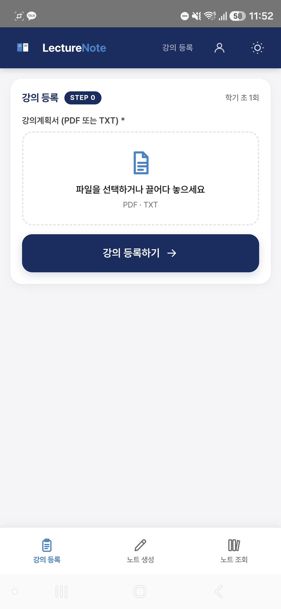
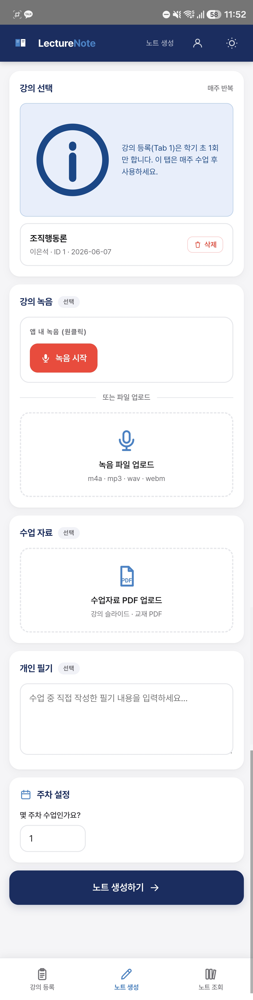

# LectureNote

> 음성·문서·필기처럼 분산된 비정형 입력에서  
> **맥락 손실 없이** 구조화된 지식을 생성하는  
> Context-Conditioned Knowledge Extraction Pipeline

`FastAPI` · `Gemini` · `PyMuPDF` · `SQLite` · `SSE`

---

## 1. The Problem

지식 집약적 업무(강의, 회의, 감사, 컨설팅 인터뷰)에서 정보는 **항상 이기종 형태로 동시에 생성된다**: 음성, 문서, 필기가 각기 다른 채널로 흘러들어온다.

기존 접근법의 핵심 실패는 처리 자체가 아니라 **맥락의 소실**이다. 각 소스를 개별 요약하면 커리큘럼 구조, 도메인 용어 체계, 평가 방향 같은 상위 컨텍스트가 출력물에 반영되지 않는다. 결과물은 내용의 집합이지, 구조화된 지식이 아니다.

LLM 자체는 요약 능력이 뛰어나지만, 입력 컨텍스트가 구조화되어 있지 않으면 출력 품질은 source ordering과 prompt phrasing에 크게 의존한다. **문제의 핵심은 모델 성능이 아니라 context orchestration에 있다.**

---

## 2. 아키텍처 접근

### Two-Phase Design

이 파이프라인은 두 단계로 동작한다.

**Phase 1 — Domain Context Build (Step 0)**

노트 생성 이전에 **도메인 구조를 선행 분석하고 영속 저장**한다.

```
POST /api/create-step0
  Input  : Syllabus / Agenda PDF
  Process: 커리큘럼 구조 추출 · 표준 용어 사전 · 강의 전략 · 시험 범위 맵
  Output : Persistent context record → DB
```

**Phase 2 — Context-Conditioned Generation**

```
POST /api/generate-note  (SSE streaming)
  Input  : Audio + PDF Slides + Handwritten notes (각 항목 선택 입력)
  Context: Step 0 record — 프롬프트 조립 시 자동 주입
  Output : Structured knowledge output + Self-Exam QA
```

Phase 2 노트 생성 시 Step 0 컨텍스트가 항상 주입된다. LLM은 단순 요약이 아니라 **도메인 구조를 인식한 생성(context-conditioned generation)** 을 수행한다.

---

### Pipeline Architecture

```
                 ┌──────────────────────────────────────┐
                 │        PHASE 1 — STEP 0              │
                 │  Syllabus PDF → Structure Extraction  │
                 │  → Persistent Context (DB)            │
                 └───────────────┬──────────────────────┘
                                 │  injected into every request
                                 ▼
 ┌──────────────────┐   ┌────────────────────────┐   ┌───────────────────┐
 │  Ingestion Layer │   │    Processing Layer     │   │   Output Layer    │
 │                  │   │                         │   │                   │
 │  Audio (.m4a)   ─┼─→ │  STT                    │   │  Structured       │
 │  PDF Slides     ─┼─→ │  PDF Parse (PyMuPDF)    ├──→│  Knowledge Output │
 │  Handwritten    ─┼─→ │  Source Aggregator      │   │  + Self-Exam QA   │
 └──────────────────┘   │  + Context Injection    │   │  (SSE stream)     │
                         └────────────────────────┘   └───────────────────┘
```

---

### Multi-Source Aggregator

`services/aggregator.py`는 각 소스를 typed context block으로 조립한다. LLM 프롬프트는 단일 텍스트가 아니라 소스 유형과 우선순위가 명시된 구조화 블록이다.

```
[STEP 1: Step 0 강의 로드맵 분석 결과]   ← 최상위 기준 (용어 사전 · 중요도 판정)
[STEP 2-1: PDF 변환 MD]                  ← 이론 구조 / 정확성
[STEP 2-2: 녹음 스크립트 TXT]            ← 구두 강조점 / Lecture Only
[STEP 2-3: 개인 필기]                    ← 학습자 주관 포인트
```

이 구조로 인해 STT 오인식 용어가 있어도 `[STEP 1]` 표준 용어 사전을 기준으로 자동 교정된다.

---

### Context-Conditioned Generation vs. Simple Summarization

| | Simple Summarization | This Pipeline |
|---|---|---|
| 컨텍스트 | 없음 (stateless) | Step 0 구조 영속 주입 |
| 용어 일관성 | LLM 임의 판단 | Step 0 용어 사전 기준 교정 |
| 중요도 판정 | 추론 기반 | Step 0 출제 경향 기반 ★ 판정 |
| 출력 | 내용 요약 | 도메인 구조 반영 노트 |
| 패턴 | — | Simplified RAG (pre-built context injection) |

**왜 Full RAG가 아닌가:**

| | Full RAG | Step 0 Context Injection |
|---|---|---|
| Retrieval | 필요 | 불필요 |
| Infra complexity | 높음 (벡터 DB, 임베딩 파이프라인) | 낮음 (SQLite 단일 레코드) |
| Latency | 높음 | 낮음 |
| Domain scope | broad corpus | narrow / single domain |
| Output predictability | medium | high |

단일 강의·단일 도메인 환경에서는 retrieval precision보다 **사전 구축된 context consistency**가 더 중요하다고 판단했다. Step 0는 retrieval 없이 pre-built context를 전체 주입하는 방식으로, 이 scope에서 full RAG보다 단순하고 예측 가능한 결과를 낸다.

---

## 3. Pipeline in Action

**Phase 1 — Step 0: Domain Context Build**

<table>
<tr>
<td align="center" width="50%">
<br/>
<sub>강의계획서 업로드 (학기 초 1회)</sub>
</td>
<td align="center" width="50%">
<br/>
<sub>커리큘럼 구조·용어 사전·시험 범위 추출 결과</sub>
</td>
</tr>
</table>

**Phase 2 — Context-Conditioned Generation**

<table>
<tr>
<td align="center" width="50%">
<br/>
<sub>멀티소스 입력: 음성 + PDF + 필기 (매주)</sub>
</td>
<td align="center" width="50%">
<br/>
<sub>[Overview]가 "[Step 0] 로드맵 상 11주차..."로 시작 — 컨텍스트 주입 확인</sub>
</td>
</tr>
</table>

---

## 4. Domain Generalizability

LectureNote의 핵심 가치는 lecture note 생성이 아니다. 본 프로젝트의 본질은 **heterogeneous unstructured inputs를 context-aware structured outputs로 변환하는 reusable architecture**다. Education domain은 그 첫 번째 적용 사례일 뿐이다.

강의/수업 도메인은 이 파이프라인에서 교체 가능한 변수다. Step 0 입력 문서와 system prompt만 바꾸면 동일 아키텍처가 다른 지식 집약 업무에 그대로 적용된다.

| 도메인 | Step 0 컨텍스트 | 입력 소스 | 출력 |
|---|---|---|---|
| 감사·실사 | 감사 체크리스트 | 인터뷰 녹음, 증빙 PDF | 리스크 항목 정리 보고서 |
| 컨설팅 | 과제 정의서 | 고객 인터뷰, 공시자료 | 구조화된 분석 초안 |
| 법무·컴플라이언스 | 규정·체크리스트 | 회의록, 계약서 PDF | 검토 요약 및 위험 플래그 |
| 기업 온보딩 | 부서 가이드라인 | 사내 강의 녹음, 정책 문서 | 부서별 지식 베이스 |

---

## 5. 기술 결정

| 결정 사항 | 선택 | 근거 |
|---|---|---|
| 백엔드 | FastAPI | 비동기 처리, SSE 지원, 자동 OpenAPI 문서화 |
| DB | SQLite | 검증 단계에서 인프라 의존성 최소화; PostgreSQL 전환 용이 |
| LLM + STT | Gemini 2.5-flash | LLM·STT를 단일 API 키로 통합, 외부 의존성 최소화 |
| PDF 출력 | HTML 파일 서빙 | 한국어 PDF 변환 라이브러리(weasyprint, xhtml2pdf)의 폰트·인코딩 한계 우회 |
| 프론트엔드 | Vanilla SPA | 빌드 파이프라인 불필요, FastAPI StaticFiles 단일 서버 배포 |

---

## 6. Pipeline Interface

핵심 엔드포인트 2개:

```
POST /api/create-step0   — Phase 1: 도메인 컨텍스트 빌드
POST /api/generate-note  — Phase 2: context-conditioned 노트 생성 (SSE)
```

전체 API reference (19개) → [docs/api/reference.md](docs/api/reference.md)

---

## 7. Deployment

**Live:** `https://lecturenote.up.railway.app`  
Railway 무료 플랜 — 최초 요청 시 약 30초 cold start 발생.

---

## 관련 문서

| 문서 | 내용 |
|---|---|
| [docs/architecture/step0-design.md](docs/architecture/step0-design.md) | Step 0 컨텍스트 추출 설계, RAG 패턴 비교 |
| [docs/architecture/aggregator.md](docs/architecture/aggregator.md) | Typed context block 구조, 우선순위 설계 |
| [docs/architecture/sse-protocol.md](docs/architecture/sse-protocol.md) | SSE 이벤트 프로토콜 상세 |
| [docs/api/reference.md](docs/api/reference.md) | 전체 API 엔드포인트 (19개) |
| [docs/deployment/constraints.md](docs/deployment/constraints.md) | 운영 제약 및 개선 계획 |
| [docs/plan.md](docs/plan.md) | Railway 배포 설정, 환경변수, 배포 순서 |
| [docs/growth.md](docs/growth.md) | 요금제 설계, B2C→B2B 확장 전략 |
| [docs/history.md](docs/history.md) | 단계별 구현 이력, 트러블슈팅 |
